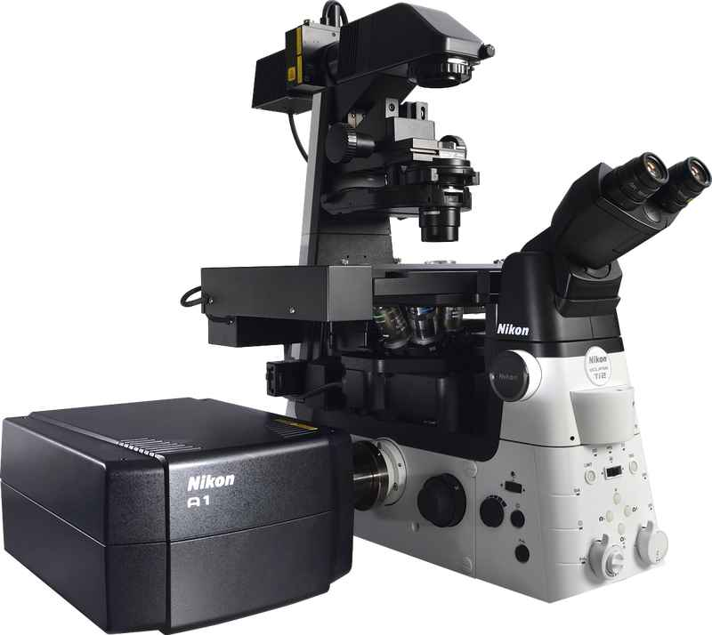

# **Module 4 Project - Human Protein Image Classification**

# **Project Overview**

In this project, I will be working with the Human Protein Atlas (HPA) image classification dataset - acquired in a highly standardized way using one imaging modality (confocal microscopy). The goal of this project is to develop models using deep learning techniques that are capable of classifying mixed patterns of proteins in microscope images. 

Visualizing proteins in cells are commonly used for biomedical research and these cells could hold the key for the next breakthrough in medicine. Thanks to advances in high-throughput microscopy, protein images are generated at a far greater pace than what can be manually evaluated. Therefore, the need is greater than ever for automating biomedical image analysis to accelerate the understanding of human cells and disease. Proteins are “the doers” in the human cell, executing many functions that together enable life. Historically, classification of proteins has been limited to single patterns in one or a few cell types, but in order to fully understand the complexity of the human cell, models must classify mixed patterns across a range of different human cells.

## Human Protein Atlas

The Human Protein Atlas (HPA) is a Swedish-based program started in 2003 with the aim to map human proteins in cells, tissues and organs. HPA uses the integration of various omics technologies, including antibody-based imaging, mass spectrometry-based proteomics, transcriptomics and systems biology. All the data in the knowledge resource is open access to allow scientists both in academia and industry to freely access the data for exploration of the human proteome.

## About Proteins

Protein structures are the three-dimensional arrangement of atoms in an amino acid-chain molecule. Proteins are polymers, specifically polypeptides, formed from sequences of amino acids - the monomers of the polymer. A single amino acid monomer may also be called a residue indicating a repeating unit of a polymer. Proteins do not function in isolation; it's their interactions with one another and also with other molecules (e.g. DNA, RNA) that mediate metabolic and signaling pathways, cellular processes, and organismal systems.

Due to their central role in biological function, protein interactions also control the mechanisms leading to healthy and diseased states in organisms. Diseases are often caused by mutations affecting the binding interface or leading to biochemically dysfunctional allosteric changes in proteins. Therefore, protein interaction networks can elucidate the molecular basis of disease, which in turn can inform methods for prevention, diagnosis, and treatment.

## Dataset

* Predict various protein structures in cellular images
* 512x512 PNG size images
* 31,100 training files
* 11,700 testing files
* 28 different target proteins (labels)
* 27 different cell types of highly different morphology
* Multiple proteins can be present in one image (multilabel classification)
* Image samples are represented by four filters
    * Protein of interest (green) 
    * Three cellular landmarks: nucleus (blue), microtubules (red), endoplasmic reticulum (yellow)
        
0.  Nucleoplasm  
1.  Nuclear membrane   
2.  Nucleoli   
3.  Nucleoli fibrillar center   
4.  Nuclear speckles   
5.  Nuclear bodies   
6.  Endoplasmic reticulum   
7.  Golgi apparatus   
8.  Peroxisomes   
9.  Endosomes   
10.  Lysosomes   
11.  Intermediate filaments   
12.  Actin filaments   
13.  Focal adhesion sites   
14.  Microtubules   
15.  Microtubule ends   
16.  Cytokinetic bridge   
17.  Mitotic spindle   
18.  Microtubule organizing center   
19.  Centrosome   
20.  Lipid droplets   
21.  Plasma membrane   
22.  Cell junctions   
23.  Mitochondria   
24.  Aggresome   
25.  Cytosol   
26.  Cytoplasmic bodies   
27.  Rods & rings
    
 # **Exploratory Data Analysis**
 
 
 
* The most common protein structures belong to organelles like the plasma membrane, the cytosol and the nucleus. 

* The least common protein structures belong to organelles like lipid droplets, peroxisomes, endosomes, lysosomes, microtubule ends, rods and rings. For these classes, the prediction might become difficult as we have only a few examples. Due to this lack of availability, we will make less accurate predictions on these lesser-occurring classes.

* As a result, model accuracy might not be the right metric to measure performance. A validation strategy should help achieve better modeling performance.

* Almost 50% of images have only 1 target
* 40% of images have 2 targets
* 10% of images have 3 targets
* < 2% of images have 4 or 5 targets

Looking at this the example of Lysosomes and Endosomes, we can already obtain some insights:

* The staining of target proteins in the green filter was not entirely successful with each iteration. The intensities of the images differ and the target proteins are not easily locatable. In the first image, the batch_loader displays endosomes that are varied in multiple regions over the cells and in the second and third you can find endosomes and lysosomes more concetrated around the nucleus. 

* Within the red channel we can see morphological differences. It looks like if the cells are of different types. This an assumption, nevertheless one could use the red channel information to reveal cell types.  

* In addition, its important to observe that the images can contain different cell densities. Sometimes the whole image is covered with cells and sometimes there are only a few. If we like to detect same targets out of different bright images, this will cause problems as we expect them to be in a similar value range. 

# **CNN Model**

A Convolutional Neural Network (CNN) is a Deep Learning algorithm which can take in an input image, assign importance (learnable weights and biases) to various aspects/objects in the image, then be able to differentiate one from the other. The architecture of a CNN is analogous to that of the connectivity pattern of neurons in the human brain and was inspired by the organization of the Visual Cortex. Individual neurons respond to stimuli only in a restricted region of the visual field known as the Receptive Field. A collection of such fields overlap to cover the entire visual area.

* **Major Problem**: Notice the baseline model was clearly uncertain to predict the presence of a target protein. Based upon the density function, most probabilities are close to zero. There are only a few with targets where the model predicted a protein structure with higher than 10%.

* Looking at the true target label count, we can see that most of the targets are filled with zeros (over 90%). This corresponds to an absence of corresponding target proteins. This makes sense because based upon EDA, for each image, we have a high probability (Almost 90%) to contain either 1 or 2 target protein structures. These label values are one whereas all others are zero. 

* Consequently, the high accuracy belongs to a correct prediction of the **absence** of target proteins. As a result, we weren't able to predict the **presence** of a target protein.

* Due to the false accuracy of the previous model, there was improvements to be made to the CNN model. Here, I focused on class imbalance. To start as improvement model, I chose the top three features (in terms of presence in the data) **nucleoplasm, cytosol and plasma membrane** and built a model that only tries to classify these three features.

# **Conclusion**

This project involved 28 different mixed protein pattern locations and 27 different cell types. Given the training data, multiple proteins can be present in one image resulting in a classification problem called multi-label classification. In multi-label classification, the training set is composed of instances each associated with a set of labels, and the task is to predict the label sets of unseen instances through analyzing training instances with known label sets. Specific to this project, target proteins can be found in multiple areas within the cell, therefore, identifying the patterns in which these proteins are found is the objective for the deep learning model. 

## Challenges 

* Multi-label classification is inherently difficult. For example, *multi-class* classification makes the assumption that each sample is assigned to one and only one label: a fruit can be either an apple or a pear but not both at the same time. Whereas, an instance of *multi-label* classification can be that a text might be about any of religion, politics, finance or education at the same time or none of these. For the project, protein patterns could be classified within many locations within a cell, or no locations. With the initial baseline CNN model, we experienced a misleading accuracy score. The high accuracy belonged to a correct prediction of the absence of target proteins. As a result, we weren't able to predict the presence of a target protein.

* Images were taken under different filter types. However initially, the images provided in the dataset are black and white. During confocal microscopy, proteins of interest were stained in a green filter. The three cellular landmarks of the nucleus (blue), microtubules (red), endoplasmic reticulum (yellow) were each stained a different color as well. In order to provide an analysis of the images during EDA, I built several functions and one class to ensure the images were loaded in the proper format and with the accurate filter type. 

* Due to the larger sizes of images, 512x512, the project needed dimensionality reduction in order for the model to train properly without overloading computer processing power. To solve this, I built an image preprocessing class that reshaped the image size to 128x128. This specific size was small enough to save processing power, but large enough to save important information regarding the protein locations. 

* Class imbalance regarding the CNN baseline model provided a misleading score. Initially, after performing cross validation, the y_pred vs. y_true accuracy scored a 94%. An amazing score for such a complex model. Digging deeper however, it's revealed that the high accuracy belongs to a correct prediction of the absence of target proteins. As a result, we weren't able to predict the presence of a target protein.

## Solutions

* To initially formulate a dataframe with individual label targets, I built a function called **targetlabels** that added a column for each individual label. So now instead of one column in the initial csv, each label has it's own column. The dataframe now has 30 columns and represents the 28 possible protein pattern locations. 

* To solve the filter problem indicated above, I built several functions and one class called **TargetGroupIterator** to ensure the images were loaded in the proper format and with the accurate filter type. To view images representing the different filter types, a batchloader was created to color maps each image (based upon its basepath _green, _red, etc.) and then iterates through each of the images that align with the target.

* To be trained on, the images needed to be loaded in a specific way so each image_id (there are four images per each id) appeared at the same time of training. Also needed to include cross-validation at this time. To perform the splitting on the train image ids, I used a repeated kfold splitter. In this way, I could easily load images and targets given the chunk ids. Though, due to RAM limitations, I used one cv-fold to explore results.

* It was important to use only the green channel of images per id. The provided information of the dataset by the Human Protein Atlas indicates that it shows the stained target proteins. The other images are simply reference points revealing the microtubules, nucleus, and endoplasmatic reticulum. 

* To solve the dimensionality problem, I built an image preprocessing class that reshaped the image size to 128x128. The aim of this was to improve the image data (features) by suppressing unwanted distortions so that our deep learning models can benefit from this improved data to work on.

* Due to the false accuracy of the previous model, there was improvements to be made to the CNN model. Here, I focused on class imbalance. To start as improvement model, I chose the top three features (in terms of presence in the data) **nucleoplasm, cytosol and plasma membrane** and built a model that only tries to classify these three features.

## Recommendations

* Mixed protein clusters occur in many areas around the cell. However, many clusters can be found around the nucleus and the processes that occur within the cytosol. This nucleus has two major functions: it stores the cell's hereditary material, or DNA, and it coordinates the cell's activities which includes intermediary metabolism, protein synthesis, and cell division.

* Protein are also commonly forming on the edges of cells. For example, the plasma membrane. the primary function of the plasma membrane is to protect the cell from its surroundings. Composed of a phospholipid bilayer with embedded proteins, the plasma membrane is selectively permeable to ions and organic molecules and regulates the movement of substances in and out of cells. 

* Overall, building a model that classifies multi-labeled imaging takes significant preprocessing and that should be accounted for when building a project plan. It would be beneficial to have several functions handy for the purpose of easy calling these functions to reduce dimensionality, batch-loading, kernel settings, and building parameters. 

## Further Work

* Continue building an effective CNN model with that battles inefficient class imbalances. 

* Perform target group analysis using a Latent Variable model.

* Perform Bernoulli Mixture model to target groups found by clustering.

* Building visualizations that show mixed protein clusters within each cell. 

## Thank you!

